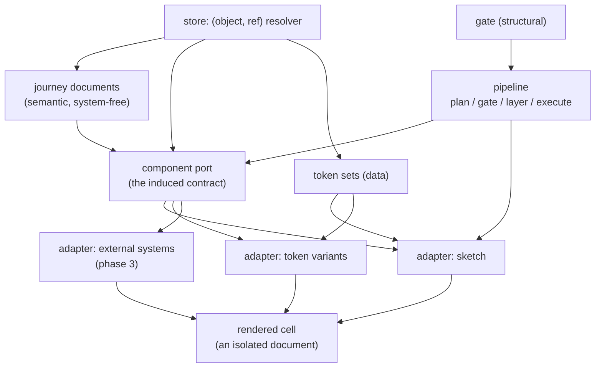

# design-space — architecture

**Status:** phase 1, pre-implementation. This is the structure-level view; it is authored
before the change it describes. Component-level detail is generated from the code as it
lands, so it cannot drift.

---

## 1. Context — what this is for

design-space exists to hold **two design conversations without letting either contaminate
the other**.

- **The journey conversation** — with the business. Which screens exist, in what order,
  carrying which controls, and what happens when you click one. Held in a deliberately
  provisional hand-drawn rendering, so nobody derails a flow discussion by objecting to a
  button colour.
- **The design system conversation** — with brand and design. The *same* journey expressed
  in several design systems, so the topic is expression rather than flow.

The product mechanic is **holding one axis still to talk about the other**. Fix the design
system and vary the journey; fix the journey and vary the design system.

This is why it is not Figma. In Figma the two are fused at the point of creation — a journey
is drawn already wearing a design system, and the drawing is the artefact. Here they are
orthogonal, and the artefact is the product of the two.

## 2. The three things

Two managed libraries and one derived view. Every decision below belongs to exactly one of
them.

| | what it is | who edits it |
|---|---|---|
| **Journeys** | semantic, design-system-free documents: screens, controls, transitions | the journey conversation |
| **Design systems** | an adapter (code) plus a token set (data) | the design system conversation |
| **The matrix** | journeys × design systems, rendered | nobody — it is derived, never stored |

The matrix is not persisted. Its cells are a function of the two libraries, which is what
makes culling a row or column cheap and reversible.

## 3. Container view



**Journey → port → adapter → markup.** A journey document says *what the user is doing*; an
adapter decides *what that looks like* in one design system. Nothing in a journey document
may name a design system, and nothing in an adapter may know which journey it is rendering.

### The port is a contract, not shared markup

The port is the **induced component vocabulary** — a set of component contracts with declared
prop shapes, derived from real journeys rather than designed a priori. An adapter *implements*
it, and may do so with completely different markup: a fixed bottom action bar, a different
confirmation pattern, its own structural opinions.

Two consequences worth stating plainly:

- **Token-only themes are a degenerate adapter.** "Lighter, more airy" reuses the sketch
  adapter's markup and changes values. That path stays cheap; it is simply no longer the only
  path. See ADR 0001.
- **The port's size is multiplied by every design system.** `components × systems` is the
  implementation surface, so extraction must merge near-duplicates aggressively. The port
  belongs in the low tens, not the low hundreds.

### The port grows monotonically

The port is derived from **all live journey variations jointly**, not per-variation. The
invariant is not that it never changes — it is that **it is the same across every cell at any
given moment**. Within a session it may gain components; it may not lose or rename them.
Without that rule a single journey edit can rename a component and invalidate every adapter,
turning `O(new × systems)` work into `O(port × systems)`. Unused components are swept between
sessions, never during one.

## 4. The two axes are not alike

This asymmetry falls out of the architecture and shows up in the UI, the sync model, and the
cost model alike.

| | down a column (one journey, many systems) | across columns (many journeys) |
|---|---|---|
| structure | identical — same screens, same order | genuinely different |
| click-through sync | valid; cells move in lockstep | meaningless; there is no shared step 2 |
| regeneration cost | adapter render — code, milliseconds | recomposition — model output, seconds |

So: **synchronise vertically, never horizontally**, and **regenerate on the journey axis
only**. A theme change re-renders a row from code; a journey change is the only thing that
costs a model call.

## 5. Fidelity is a feature, not a stage

The hand-drawn rendering is not "the undesigned mode" — mechanically it is a design system
like any other, the fifth theme alongside four systems, with no special rendering path. But in
the product it is **the editing surface and the default**, and the craft budget goes there
disproportionately. A mediocre theme render is a shrug; a mediocre sketch render breaks the
conversation the tool exists to have.

Two rules follow:

- **In journey mode the design systems are hidden, not merely small.** The value of low
  fidelity is that it *withholds* information so feedback arrives at the resolution you are
  working at. A themed cell visible during a flow discussion reimports exactly the distraction
  the sketch was protecting you from.
- **Themed cells must not look finished either.** A polished render implies decisions —
  imagery, microcopy, real spacing — that have not been made. Two levels of fidelity, neither
  of them shipped-looking.

The sketch style carries "provisional" through **typography and colour**, not wobbly geometry:
handwriting face, warm paper, ink rather than black, one hard offset shadow, straight borders.
That choice survives arbitrary generated content, where wobbly geometry fights every layout and
gets twee at scale.

## 6. Storage

Everything is addressed as **`(object, ref)`** and resolved through one resolver — journey
documents, port, adapters, token sets (ADR 0002). Variations are **branches**; the port and
adapters are read at **trunk** (ADR 0003). Rendering reads at a ref and never checks anything
out, so all four columns are readable at once without a working tree ever moving.

The real state is small: *n* journey documents, *m* token sets, *m* adapter modules, one port.
The sixteen cells are derived.

## 7. The gate is structural, not testimonial

Design has no red/green check for taste, and this architecture does not pretend otherwise. What
it does supply is a set of checks that are countable:

- **coverage** — does this adapter implement every component in the port?
- **escape hatches** — did any component render by falling back rather than by mapping?
- **resolution** — do all referenced tokens exist?
- **contrast** — does the rendered output meet the declared contrast bar?

None of these needs an agent to attest to anything. Where a real external design system
*cannot* implement a port component, that gap is **the deliverable, not a bug** — it locates a
hole in that system precisely, as a by-product of a conversation the client already wanted.

This is why the phase order matters: token adapters are total by construction (every component
renders in every theme), so gaps only become meaningful when real systems arrive in phase 3.

## 8. Regeneration

The pipeline runs on `@verevoir/recipes/engine`, which supplies plan → gate → layer →
execute-concurrently with the enactment injected.

| engine stage | design-space |
|---|---|
| plan | a journey edit → what recomposes, which new port components, which cells |
| gate | coverage, resolution, escape hatches |
| layer | port before adapters before renders |
| execute-concurrently | the cell fan |

design-space is a **dispatcher** in this architecture: it drives the engine and publishes its
own claims. It is not a runner consumer in phase 1.

**Adapter output is content-addressed** on `(port version, component, system)` and only cache
misses are generated. This is about trust rather than speed: adapter markup is model-generated,
so regenerating it produces different-but-equally-valid output. If cells in an untouched column
shift during a workshop, people will see it, and they will be right to stop trusting the grid.

### The latency budget

Cost is not the constraint; **latency in a live room** is. Everything above collapses the
critical path between an instruction and an answer to:

> one composition, rendered through one already-existing adapter

One model call, no adapter work unless the edit introduced a genuinely new component. The other
columns and the themed rows stream in behind while the conversation continues.

## 9. Repository shape

A monorepo whose package boundaries are sized to become repositories (ADR 0004). Dependencies
flow one way; no deep imports across packages.

```
packages/
  journey-model/    schema, types, validation.  Knows nothing about rendering.
  port/             component contracts + extraction from journeys.
  adapter-sketch/   the reference adapter. Hand-crafted.
  adapter-tokens/   degenerate token-variant adapters over the sketch markup.
  store/            the (object, ref) resolver. Git-backed today.
  gate/             the structural checks of §7.
  pipeline/         plan/gate/layer/execute over @verevoir/recipes/engine.
  studio/           the two modes: journey editing, and the matrix.
examples/journeys/  the reference journey the port is induced from.
docs/               this file, and the ADRs.
```

## 10. Deferred, with triggers

Recorded as deferred rather than silently defaulted (ADR 0005).

| deferred | trigger to decide |
|---|---|
| screen **states** (empty / error / in-progress) on the journey schema | the first journey whose conversation is about a failure path |
| conversation-addressed storage (overlay over immutable base) | cloud-runner lands a composition root, toolbelt writers, and `GateRunner` |
| in-page chat | anyone other than the operator needs to drive it |
| real external design-system adapters | a client engagement where their own kit on screen is the point |
| propagating an edit across variations | the second time a label fix has to be made four times by hand |
