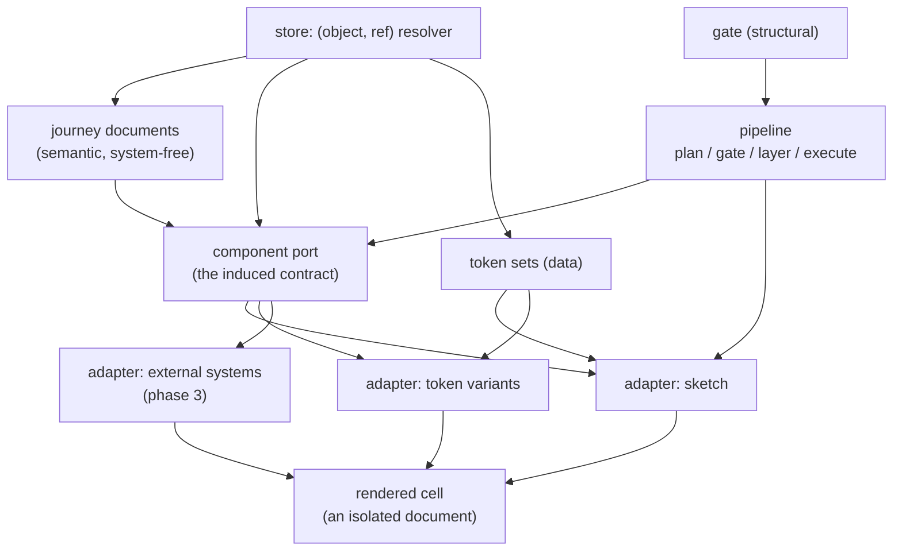

# design-space — architecture

**Status:** phase 1, pre-implementation. This is the structure-level view; it is authored
before the change it describes. Component-level detail is generated from the code as it
lands, so it cannot drift.

---

## 1. Context — what this is for

design-space exists to hold **two design conversations without letting either contaminate
the other**.

- **The journey conversation** — with the business. Which screens exist, in what order,
  carrying which controls, and what happens when you click one. Held in a deliberately
  provisional hand-drawn rendering, so nobody derails a flow discussion by objecting to a
  button colour.
- **The design system conversation** — with brand and design. The *same* journey expressed
  in several design systems, so the topic is expression rather than flow.

The product mechanic is **holding one axis still to talk about the other**. Fix the design
system and vary the journey; fix the journey and vary the design system.

This is why it is not Figma. In Figma the two are fused at the point of creation — a journey
is drawn already wearing a design system, and the drawing is the artefact. Here they are
orthogonal, and the artefact is the product of the two.

## 2. The three things

Two managed libraries and one derived view. Every decision below belongs to exactly one of
them.

| | what it is | who edits it |
|---|---|---|
| **Journeys** | semantic, design-system-free documents: screens, controls, transitions | the journey conversation |
| **Design systems** | an adapter (code) plus a token set (data) | the design system conversation |
| **The matrix** | journeys × design systems, rendered | nobody — it is derived, never stored |

The matrix is not persisted. Its cells are a function of the two libraries, which is what
makes culling a row or column cheap and reversible.

## 3. Container view



**Journey → port → adapter → markup.** A journey document says *what the user is doing*; an
adapter decides *what that looks like* in one design system. Nothing in a journey document
may name a design system, and nothing in an adapter may know which journey it is rendering.

### The port is a contract, not shared markup

The port is the **induced component vocabulary** — a set of component contracts with declared
prop shapes, derived from real journeys rather than designed a priori. An adapter *implements*
it, and may do so with completely different markup: a fixed bottom action bar, a different
confirmation pattern, its own structural opinions.

What an adapter supplies is markup, styles and tokens (ADR 0008): component renderers, a CSS
rules string written against `var(--ds-*)`, and its token set as structured data rather than an
opaque blob — structured because the contrast check of §7 has to read a value, not parse a
stylesheet. That contract lives in its own package, `adapter-contract`, deliberately not in
`port`, which may not know about rendering. `render`, `gate` and `adapter-sketch` all consume it
in-repo today; an externally-published adapter (ADR 0008's phase 3) has not happened yet.

`assertAdapter()` enforces the contract at runtime — TypeScript's structural typing erases at
the type-check boundary, so a caller built against the old `name`/`components` shape would
otherwise compile against the wider `Adapter` type with nothing checking the new fields. It
checks shape (`styles` is a string, `tokens` a plain record) and content: `styles` against a
denylist rejecting `</style`, the only real escape vector inside a raw-text `<style>` element;
token names and values against an allowlist, since they interpolate inside a `:root { }`
declaration block where `}` and `;` are live and a token was never meant to carry arbitrary CSS.
`render` and `gate` both call it before accepting an adapter. `gate` previously carried its own
copies of `AdapterLike` and `GapRecord` in `adapter-like.ts`. That file is gone: `AdapterLike`
now comes from `adapter-contract`, and `GapRecord` from `render`, whose result type it always
was.

**CSS-based exfiltration is an accepted risk today, not a mitigated one.** Adapters are in-repo
and trusted — an adapter author already has full code execution, so a `styles` string containing
`url()` or `@import` could beacon to, or pull content from, a remote host. The `</style` denylist
does not address this and is not meant to; it closes the HTML break-out vector alone. This becomes
a real risk once phase 3 admits externally-published adapters, and a Content-Security-Policy from
`serve.ts` restricting what the document may fetch is the required mitigation before that phase —
not a commitment made by this change.

Two consequences worth stating plainly:

- **Token-only themes are a degenerate adapter.** "Lighter, more airy" reuses the sketch
  adapter's markup and changes values. That path stays cheap; it is simply no longer the only
  path. See ADR 0001.
- **The port's size is multiplied by every design system.** `components × systems` is the
  implementation surface, so extraction must merge near-duplicates aggressively. The port
  belongs in the low tens, not the low hundreds.

### The port grows monotonically

The port is derived from **all live journey variations jointly**, not per-variation. The
invariant is not that it never changes — it is that **it is the same across every cell at any
given moment**. Within a session it may gain components; it may not lose or rename them.
Without that rule a single journey edit can rename a component and invalidate every adapter,
turning `O(new × systems)` work into `O(port × systems)`. Unused components are swept between
sessions, never during one.

## 4. The two axes are not alike

This asymmetry falls out of the architecture and shows up in the UI, the sync model, and the
cost model alike.

| | down a column (one journey, many systems) | across columns (many journeys) |
|---|---|---|
| structure | identical — same screens, same order | genuinely different |
| click-through sync | valid; cells move in lockstep | meaningless; there is no shared step 2 |
| regeneration cost | adapter render — code, milliseconds | recomposition — model output, seconds |

So: **synchronise vertically, never horizontally**, and **regenerate on the journey axis
only**. A theme change re-renders a row from code; a journey change is the only thing that
costs a model call.

## 5. Fidelity is a feature, not a stage

The hand-drawn rendering is not "the undesigned mode" — mechanically it is a design system
like any other, the fifth theme alongside four systems, with no special rendering path. But in
the product it is **the editing surface and the default**, and the craft budget goes there
disproportionately. A mediocre theme render is a shrug; a mediocre sketch render breaks the
conversation the tool exists to have.

Two rules follow:

- **In journey mode the design systems are hidden, not merely small.** The value of low
  fidelity is that it *withholds* information so feedback arrives at the resolution you are
  working at. A themed cell visible during a flow discussion reimports exactly the distraction
  the sketch was protecting you from.
- **Themed cells must not look finished either.** A polished render implies decisions —
  imagery, microcopy, real spacing — that have not been made. Two levels of fidelity, neither
  of them shipped-looking.

The sketch style carries "provisional" through **typography and colour**, not wobbly geometry:
handwriting face, warm paper, ink rather than black, one hard offset shadow, straight borders.
That choice survives arbitrary generated content, where wobbly geometry fights every layout and
gets twee at scale.

## 6. Storage

Everything is addressed as **`(object, ref)`** and resolved through one resolver — journey
documents, port, adapters, token sets (ADR 0002). Variations are **branches**; the port and
adapters are read at **trunk** (ADR 0003). Rendering reads at a ref and never checks anything
out, so all four columns are readable at once without a working tree ever moving.

The real state is small: *n* journey documents, *m* token sets, *m* adapter modules, one port.
The sixteen cells are derived.

## 7. The gate is structural, not testimonial

Design has no red/green check for taste, and this architecture does not pretend otherwise. What
it does supply is a set of checks that are countable:

- **coverage** — does this adapter implement every component in the port?
- **escape hatches** — did any component render by falling back rather than by mapping?
- **resolution** — do all referenced tokens exist?
- **contrast** — does the rendered output meet the declared contrast bar?

None of these needs an agent to attest to anything. Where a real external design system
*cannot* implement a port component, that gap is **the deliverable, not a bug** — it locates a
hole in that system precisely, as a by-product of a conversation the client already wanted.

This is why the phase order matters: token adapters are total by construction (every component
renders in every theme), so gaps only become meaningful when real systems arrive in phase 3.

## 8. Regeneration

The pipeline runs on `@verevoir/recipes/engine`, which supplies plan → gate → layer →
execute-concurrently with the enactment injected.

| engine stage | design-space |
|---|---|
| plan | a journey edit → what recomposes, which new port components, which cells |
| gate | coverage, resolution, escape hatches |
| layer | port before adapters before renders |
| execute-concurrently | the cell fan |

design-space is a **dispatcher** in this architecture: it drives the engine and publishes its
own claims. It is not a runner consumer in phase 1.

**Adapter output is content-addressed** on `(port version, component, system)` and only cache
misses are generated. This is about trust rather than speed: adapter markup is model-generated,
so regenerating it produces different-but-equally-valid output. If cells in an untouched column
shift during a workshop, people will see it, and they will be right to stop trusting the grid.

### The latency budget

Cost is not the constraint; **latency in a live room** is. Everything above collapses the
critical path between an instruction and an answer to:

> one composition, rendered through one already-existing adapter

One model call, no adapter work unless the edit introduced a genuinely new component. The other
columns and the themed rows stream in behind while the conversation continues.

## 9. Repository shape

A monorepo whose package boundaries are sized to become repositories (ADR 0004). Dependencies
flow one way; no deep imports across packages.

```
packages/
  journey-model/    schema, types, validation.  Knows nothing about rendering.
  port/             component contracts + extraction from journeys.
  adapter-contract/ the Adapter contract: components, styles, structured tokens, and the
                    assertAdapter() runtime guard (shape and content). Consumed by render,
                    gate and adapter-sketch.
  adapter-sketch/   the reference adapter. Hand-crafted.
  adapter-tokens/   degenerate token-variant adapters over the sketch markup.
  store/            the (object, ref) resolver. Git-backed today.
  render/           journey + adapter -> one standalone document.
  gate/             the structural checks of §7.
  pipeline/         plan/gate/layer/execute over @verevoir/recipes/engine.
  studio/           the two modes: journey editing, and the matrix.
examples/journeys/  the reference journey the port is induced from.
docs/               this file, and the ADRs.
scripts/            logic the workflows call, kept here so it can be tested: the preview
                    smoke checks, tag removal, gcloud URL extraction, the PR comment's
                    update-or-create decision, and the journey-derived smoke expectations
                    (journey-expectations.mjs). scripts/promote/ holds the promotion's own
                    decision logic — the green-gate wait, the ancestry and tree-equality
                    checks, traffic capture/shift/restore, retagging, and the authorization
                    check — for the same reason: inline workflow code only runs when its
                    trigger fires, which for a rollback path can be never until it matters.
tests/              tests for the review gate and for scripts/ (see below).
.github/
  workflows/        CI, the antagonistic-review panel, the per-PR preview deploy
                    (`preview.yml`), and the label-triggered promotion (`promote.yml`).
  antagonistic-review/   the panel's scripts. All of them move together.
```

Two of the panel's scripts fail **silently** when absent — `stamp-diff-hash.sh` sits behind an
`if [ -f ]` guard and `panel-memory.sh`'s step is `continue-on-error` — so an incomplete seed
looks exactly like a panel that ran and found nothing. That is deliberate (the memory must never
gate a merge), and it is why the gate's tests live in `tests/` rather than being trusted to a
green build.

## 9a. The operational plane

How this is built, deployed and identified — recorded here so nobody has to read the Dockerfile,
IAM or a workflow to learn it.

### Build

Two stages. The builder installs dependencies, runs `tsc -b`, then runs `prerender` against the
repository to write `dist/document.html` and its gaps sidecar. The runtime stage copies only the
compiled output and production dependencies: **no git, no devDependencies, no source**, and it
does not carry `gate` or `pipeline`, which `serve.ts` never imports.

Both stages pin `node:20-slim` **by digest**, not by tag, so the same source builds the same
image over time.

**The image must be `linux/amd64`.** A build on Apple Silicon produces `arm64`, which Cloud Run
rejects at startup with `exec format error` — the container never listens and the deploy fails on
the startup probe. Where no cross-builder is available, `gcloud builds submit` builds natively.

### Deploy

| | |
|---|---|
| service | `design-space-studio`, Cloud Run, `europe-west2` |
| project | `design-space-505306` (number `959702328785`) |
| scaling | `min-instances=0`, `max-instances=2`, 256Mi, 1 vCPU |
| ingress | authenticated only — not public |
| runtime identity | `ds-runtime@…` — **holds no permissions at all** |
| deploy identity | `ds-deployer@…` — `run.admin`, `artifactregistry.writer`, and `actAs` scoped to `ds-runtime` alone |
| CI auth | Workload Identity Federation, provider condition `assertion.repository=='verevoir/design-space'`. **No service-account key exists**, which matters because the repository is public. |

### Idle cost

`min-instances=0` means no instance runs when nothing is being served, so **compute at idle is
zero** — Cloud Run bills per request and per instance-second, and a revision carrying neither a
tag nor traffic is scaled to zero instances rather than left running. **Measured 2026-08-17**
(a point-in-time count, not a current one — see backlog.md 2S.2): 69 revisions existed, 65
carried neither a tag nor traffic, and **zero of those held a warm instance**. So the compute
figure is a structural fact of Cloud Run's scaling model, confirmed by counting, rather than an
estimate.

**The standing cost is Artifact Registry storage for the pushed images, and that figure remains
unmeasured.** Story 2S.2's done-bar asks for the idle cost as a number rather than the word
"cheap"; the compute half is answered above, and the storage half is outstanding — a real billing
read is the only thing that supplies it, and none has been taken. Recorded as outstanding rather
than estimated, because an arithmetic guess dressed as a measurement is the failure this project
keeps finding.

### Per-PR preview deployments

`.github/workflows/preview.yml` gives every pull request its own deployment (ADR 0007, story
2S.3):

| trigger | what happens |
|---|---|
| PR opened / updated | build, push to Artifact Registry, `run deploy --no-traffic --tag pr-<n>` |
| then | smoke tests against that tag's URL, and the URL posted as a PR comment |
| PR closed | the `pr-<n>` tag is removed |
| PR from a fork | deploy skipped, with the reason stated in the job summary |

Auth is keyless — Workload Identity Federation, with the smoke step's ID token minted by the auth
action and **scoped to the SERVICE url**, not the tag url: Cloud Run validates an audience against
the service, and a token minted for a per-tag hostname is rejected with a bare `Unauthorized`.

The workflow deliberately holds almost no logic. Tag-URL extraction, the preview comment's
update-vs-create decision, the smoke checks and the tag removal all live in `scripts/` with tests,
because **inline workflow code is only executed when its trigger fires** — and a stray `fi` sat
undetected in the cleanup step through several green runs for exactly that reason. Every `run:`
block is now parsed with `bash -n` at test time.

### Promotion (`promote.yml`)

A separate workflow from `preview.yml`, triggered by the `promote` label rather than by every
push (ADR 0007, story 2S.4). A pull request already has a `pr-<n>` preview from the workflow
above; labelling it `promote` runs a distinct sequence that turns that same change into the
change production is serving, and then lands it:

| step | what happens |
|---|---|
| guard | fork PRs are skipped, with the reason in the job summary — WIF cannot issue them a credential |
| authorization | the actor who applied the label is checked for **admin or write** permission via the GitHub API. Applying a label itself needs only GitHub's `triage` role, which is narrower than write — this closes that gap explicitly rather than relying on it |
| green gate | wait for every other check on the commit to conclude green, excluding this workflow's own check (else it would wait on itself) |
| ancestry | assert the branch is up to date with its base — the last point at which stopping costs nothing |
| deploy candidate | build, push, deploy a `candidate` revision **pinned by image digest**, carrying no traffic |
| canary | smoke the candidate at zero traffic, cut 10%, health-check the candidate tag URL specifically, cut 100% — this is where production traffic is pinned to the candidate revision, by name |
| merge | squash-merge the pull request — only now, after the change has served all of production |
| verify | assert the merged tree equals the canaried tree |
| finish | retag the proven digest onto the merge commit, then drop the `candidate` tag — traffic is not touched again here; it was already pinned at the canary step above |
| close preview | GitHub suppresses `pull_request: closed` for a merge performed by this workflow's own token, so `preview.yml`'s cleanup job — which only removes the `pr-<n>` tag — never runs for a self-promoted merge. This step restores that tag removal, and additionally deletes the head branch, which no existing job did |

**Rollback.** On failure or cancellation (including the job's own `timeout-minutes` bound, which
GitHub reports as `cancelled` rather than `failed`) — but only while a restore point exists and
only while the merge has not succeeded. That second condition is checked twice: once from the
workflow's own step conclusion, and independently by asking GitHub directly whether the pull
request is actually `MERGED`, since a step's conclusion can read `cancelled` even after the
underlying `gh pr merge` call already succeeded. **After a successful merge, traffic is left on
the canaried revision** — the proven artefact — and an operator decides; nothing is retagged or
rolled back automatically, because the commit is already on `main` and cannot be un-merged here.

Auth, identities and the digest pin are shared with the deploy path described above. The
decision logic — the green-gate wait, the ancestry and tree-equality checks, traffic capture and
restore, retagging, the authorization check — all live in `scripts/promote/` with tests, for the
same reason as the preview workflow: inline `run:` code only runs when its trigger fires, which
for a rollback path can be never until the day it matters.

### Two identities, and why

| identity | holds | used for |
|---|---|---|
| `ds-deployer` | `run.admin`, `artifactregistry.writer`, `actAs` on `ds-runtime` | building, pushing, deploying, traffic |
| `ds-invoker` | `roles/run.invoker` on `design-space-studio` **and nothing else** — no project-level grant at all | minting the smoke test's ID token |
| `ds-runtime` | nothing | the identity the container runs as |

The smoke test calls the service; it has no business being able to administer it. Minting its
token as the deployer put `run.admin` behind a curl, so a workflow change that leaked the token
would have leaked an administrative credential. All three are assumable only under the WIF
provider condition `assertion.repository=='verevoir/design-space'`.

### `/health` says which build answered

It returns `status`, `portVersion` and `revision`. `revision` is Cloud Run's `K_REVISION`, echoed
back, and is `null` when the container runs anywhere else. It exists because `portVersion` is a
compile-time constant of the port package, so every build of a given port version reports the same
value and no caller can tell two of them apart. The promotion's health check needs exactly that
distinction — at a 10% traffic split the incumbent answers most requests, so a check that could
not name the revision would pass without ever reaching the candidate.

### The health endpoint is `/health`

Not `/healthz`. Cloud Run's frontend intercepts `/healthz` and returns its own 404 — the request
never reaches the container — while `/health`, `/readyz`, `/-/health` and arbitrary paths all
arrive normally. This was established against the running service after Google's own documentation
suggested the opposite; see the README for the evidence.

## 10. Deferred, with triggers

Recorded as deferred rather than silently defaulted (ADR 0005).

| deferred | trigger to decide |
|---|---|
| screen **states** (empty / error / in-progress) on the journey schema | the first journey whose conversation is about a failure path |
| conversation-addressed storage (overlay over immutable base) | cloud-runner lands a composition root, toolbelt writers, and `GateRunner` |
| in-page chat | anyone other than the operator needs to drive it |
| real external design-system adapters | a client engagement where their own kit on screen is the point |
| propagating an edit across variations | the second time a label fix has to be made four times by hand |
